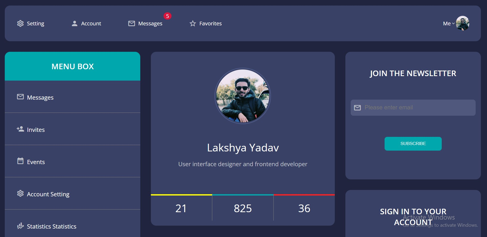
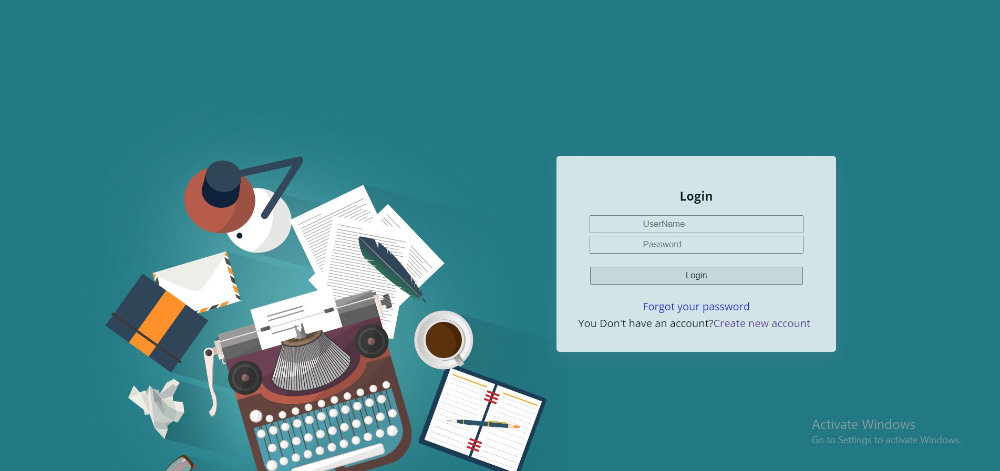
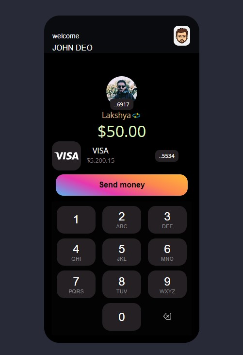

# My HTML/CSS Learning Journey
Hi, I'm Lakshya Yadav. Below is my code journey towards becoming a better Front-end Developer.
 

## My Projects
In my coding journey, I have built various projects. To enhance my learning of core HTML/CSS concepts.
I'll be demostrating that below.

 
 

### 1. Project Dashboard ([Link](./project-dashboard/README.md))

### 2. Project Login-Form([Link](./project-login-form/README.md))

## 3. Project Portfolio-card([Link](./project-portfolio-card/README.md))

## 4. Project Payment-card([Link](./project-payment-card/README.md))
